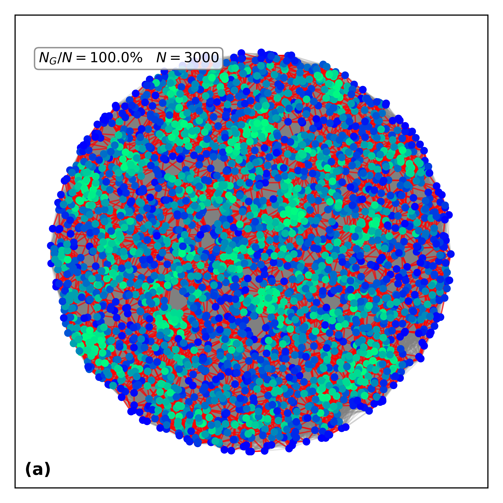

# 🌐 Dynamics of the Quantum Internet Network

---

## 🧩 Step 1 – Fiber-Optics Network Simulation

We begin by uniformly distributing $N$ nodes within a disk of radius $R$. To model how optical fibers connect these nodes, we use the **Waxman model**. In this model, each pair of nodes $i$ and $j$ is connected by a fiber with probability:

$$
\Pi_{ij} = \beta e^{-d_{ij}/\alpha L}
$$

where $d_{ij}$ is the Euclidean distance between nodes $i$ and $j$, $L$ is the maximum distance between any two nodes, $\alpha > 0$ controls the typical edge length of the network, and $0 < \beta \leq 1$ determines the average degree of connectivity. These parameters have been estimated for real-world fiber-optic networks. For example, in the U.S. backbone network it was found that $\alpha L = 226$ km and $\beta = 1$. We adopt these values in the simulations presented here.

---

## 🧩 Step 2 – Photonic Network Simulation

Once the fiber-optics network is constructed, we simulate the transmission of photons through it. Photonic losses are known to grow exponentially with fiber length. More precisely, the **transmissivity**, i.e., the fraction of energy received at the output of a fiber link connecting nodes $i$ and $j$, is given by:

$$
p_{ij} = 10^{-\gamma d_{ij}/10}
$$

where $d_{ij}$ (in kilometers) is the Euclidean distance between the nodes, and $\gamma$ is the fiber loss coefficient, which depends on the photon wavelength. For instance, in silica fibers, losses are minimized at a wavelength of $1550$ nm, resulting in $\gamma \approx 0.2$ dB/km, a value we use in our simulations. Even with technological advances, the physical loss limit of silica fibers is estimated to lie between 0.095 and 0.13 dB/km.

Finally, we define the probability $P_{ij}$ that two nodes are effectively connected by a photonic link as:

$$
P_{ij} = 1 - (1 - p_{ij})^{n_p}
$$


# 🌐 Quantum Network Simulator

Simulator for **quantum photonic networks** using **Waxman random graphs**.  
This project generates fiber networks, simulates photonic survival of links, and visualizes the resulting network.

---

## 📂 Project Structure

```
quantum-network-simulator/
├── README.md
├── requirements.txt
├── main.py                   # CLI entry point
├── simulator.py              # Core simulator class
└── quantum_network/
    ├── __init__.py
    ├── cli.py
    └── utils.py
```

## 📦 Installation

1. Clone this repository:
```bash
git clone https://github.com/yourusername/quantum-network-simulator.git
cd quantum-network-simulator
```

2. Create and activate a virtual environment:
```bash
python -m venv .venv
source .venv/bin/activate   # Linux/Mac
.venv\Scripts\activate      # Windows
```

3. Install dependencies:
```bash
pip install -r requirements.txt
```

---

## ▶️ Execution (CLI)

You can run the simulator directly from the command line.

### Basic example
```bash
python main.py -N 1000 --g 0.2 -o rede.png
```

This generates a quantum network with:
- **1000 nodes**  
- **attenuation factor** `g = 0.2`  
- output saved to `rede.png`

---

## ⚙️ Parameters

| Argument        | Default      | Description |
|-----------------|-------------:|-------------|
| `-N`            | `500`        | Number of nodes in the network |
| `--R`           | `1800`       | Radius of the area |
| `--aL`          | `226`        | Characteristic length scale |
| `--b`           | `1.0`        | Scaling factor for edge probability |
| `--g`           | `0.2`        | Attenuation factor |
| `--np_photons`  | `1000`       | Number of photons |
| `--A_value`     | `5.2e4`      | Parameter for node coloring |
| `-o`, `--output`| `quantum_network.png` | Output filename |

---

## 📊 Examples

1. **Generate a larger network**  
```bash
python main.py -N 5000 --R 2500 -o big_network.png
```

2. **Increase photon number**  
```bash
python main.py -N 1500 --np_photons 2000 -o photons.png
```

3. **Modify edge probability scaling**  
```bash
python main.py -N 2000 --b 0.5 --A_value 1e5 -o custom.png
```

4. **Plot simulation results**  
```bash
python main.py -N 3000 --g 0.2 -o network.png
```


<p align="center">
  
</p>


